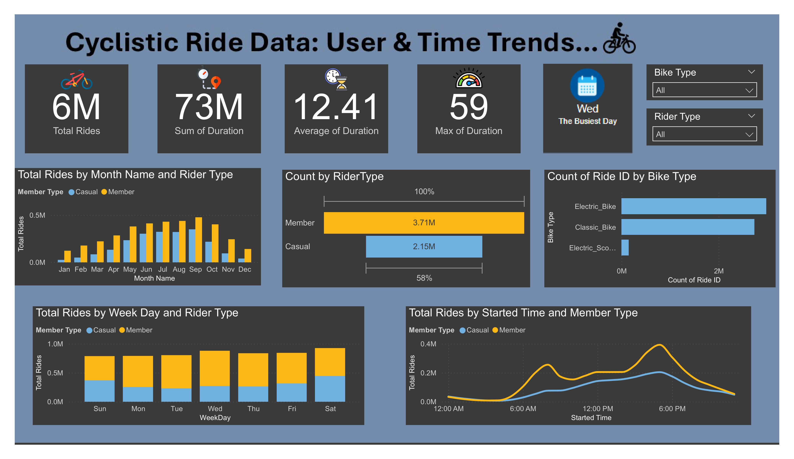

# 🚴 Cyclistic Bike Share Analysis

## 📌 Overview  
This project analyzes **Cyclistic’s bike share data** to identify trends in user behavior and provide marketing strategies to **convert casual riders into annual members**.  

The analysis explores how **casual riders and members differ**, their riding patterns, and how digital marketing can encourage more sign-ups.  

---

## 📊 Dataset  
- **Source:** Cyclistic Public Bike Share Data  
- **Data Includes:**  
  - **Trip details:** ride ID, start & end times, station names, and bike types  
  - **User classification:** Casual riders vs. Annual members  
  - **Geographical data:** Latitude & Longitude of stations  

**Note:** The dataset is not included due to privacy policies but can be accessed from [here](https://www.kaggle.com/datasets/langnguyengiathinh/cyclistic-bike-share-2023-2024-case-study).  

---

## 🛠️ Data Cleaning & Preparation  
- **Removed duplicates and missing values**  
- **Created new columns:** ride duration, weekday names, and ride distance  
- **Converted timestamps** into proper date/time format  
- **Filtered out incomplete ride records**  

---

## 📈 Key Findings  
✔ **Members ride consistently throughout the year**, while casual riders peak during **summer months and weekends**.  
✔ **Members primarily use bikes for commuting**, whereas **casual riders use them for leisure**.  
✔ **Electric bikes are more popular among casual riders**, while members prefer classic bikes.  
✔ **Peak ride times:**  
   - Members: **Morning & evening commute hours**  
   - Casual riders: **Midday & evenings**  

---

## 📊 Power BI Dashboard  
🔗 **Check out the interactive Power BI dashboard:** [Dashboard Link](#)  
  

---

## 🔝 Business Recommendations  
1️⃣ **Promote Membership Discounts:**  
   - Offer **summer membership promotions** to convert casual riders.  
   - Provide **"first-month free" trials** for frequent casual riders.  

2️⃣ **Increase Digital Marketing & Engagement:**  
   - Use **social media ads** to promote membership benefits.  
   - Send **personalized emails** showing how much casual riders could save.  

3️⃣ **Expand Electric Bike Availability:**  
   - Invest in **more electric bikes** since they are popular among casual riders.  
   - Place **bike stations near tourist and leisure areas** to increase sign-ups.  

---

